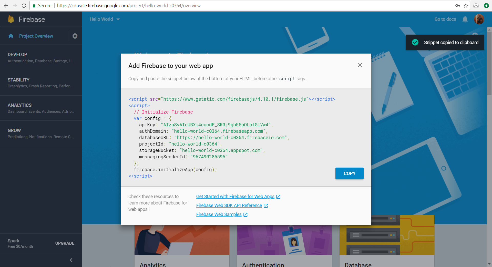
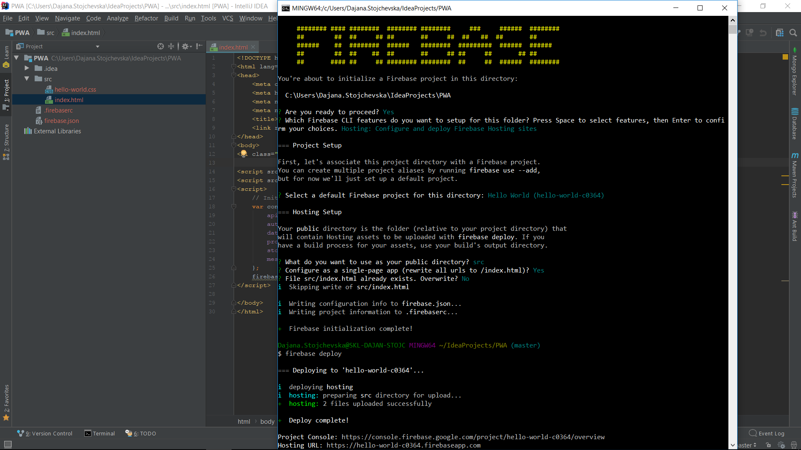
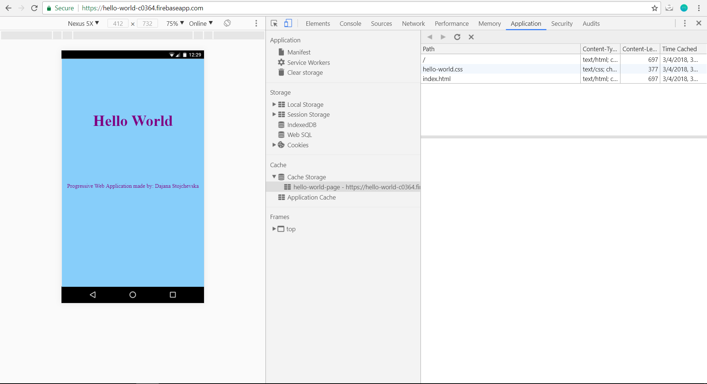
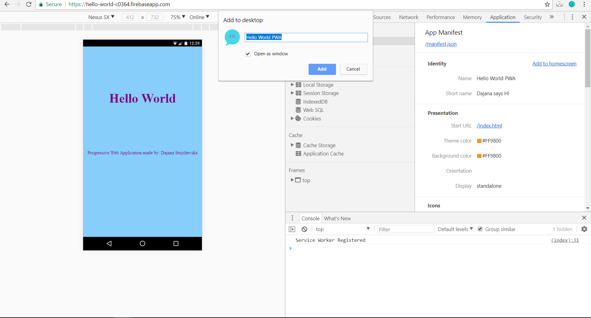
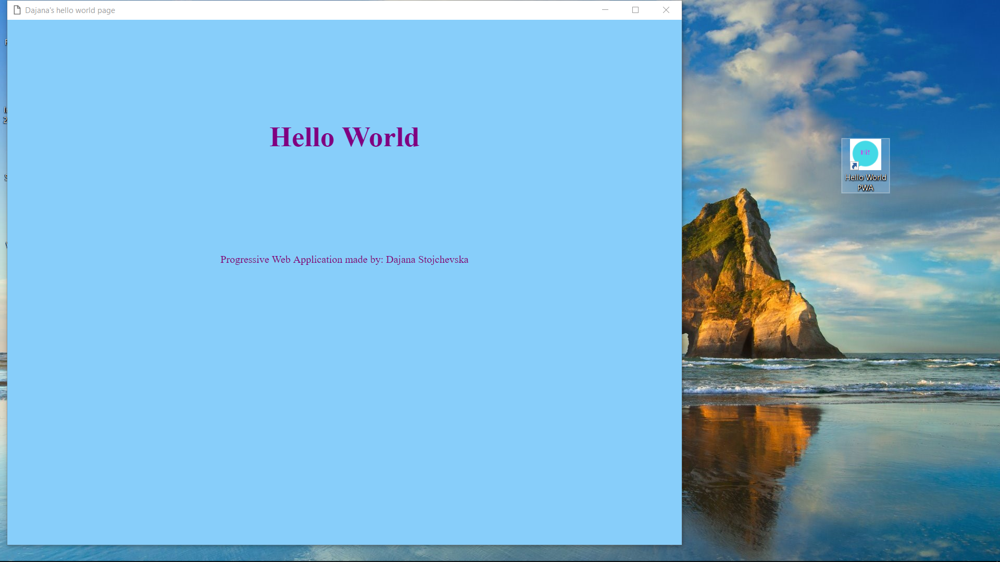
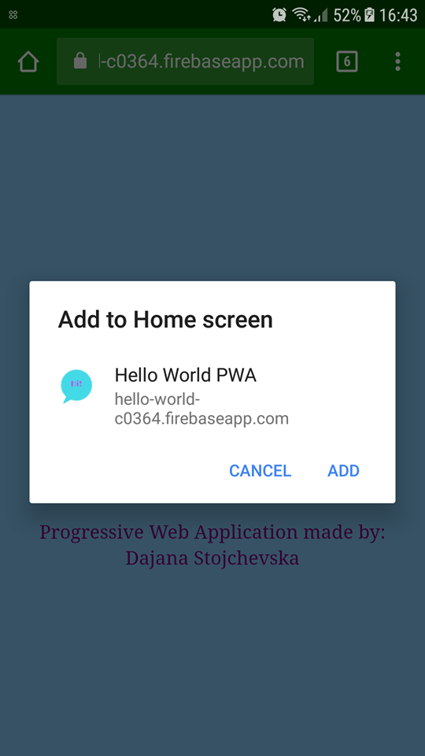
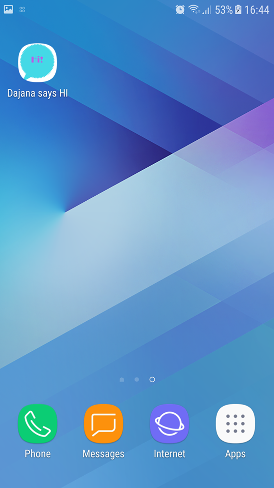

# Hello World - Progressive Web Application

## 15 steps to create a simple Hello World PWA

1. Create a directory named as the name of the application, in my case *PWA*.
2. Inside that directory, create a new one named *src*.
3. Inside *src* create an [index.html](src/index.html) file (without `script` tags) and a [.css](src/hello-world.css) file
4. According to [Firebase docs](https://firebase.google.com/docs/web/setup), create a Firebase project in the [Firebase console](https://console.firebase.google.com/). Mine looks like this:

5. Copy the snippet into [index.html](src/index.html) file.
6. Check if [node.js](https://nodejs.org/en/download/) is installed and if it is not install it. It is prerequisite for the next step.
7. [If not done already] Install firebase writing the command `npm install -g firebase-tools` in a console and login with the same gmail account used in Step 4 using `firebase login`.
8. Position into the directory of the application, which is *PWA* in my case, and write the command `firebase init`.

9. Follow the answers as in the screenshot and then write the command `firebase deploy`.
10. Register service worker, by adding service worker `<script>` to [index.html](src/index.html) file.
11. In *src* create [sw.js](src/sw.js) file and `index.html` and add `hello-world.css` to `hello-world-page cache`.
12. Re-deploy and now check Cache Storage in Chrome's DevTools under Application tab:

13. Create an icon ([here is mine](https://www.canva.com/design/DACxDumhhC0/hSIF_o013kTS_IgznaEzYw/view?website)) and save it in sizes 128x128, 144x144, 152x152, 192x192, 512x512 (I used [this](http://resizeimage.net/)). Save them in a directory named *icons* which is under *src*.
14. To support the feature **Add to homescreen**, create a [manifest.json](src/manifest.json) file and link it in [index.html](src/index.html).
15. The project is ready and available in the URL given in the console, in my case [here](https://hello-world-c0364.firebaseapp.com/).
It can be added to Desktop, or HomeScreen on mobile device, as follows. Information like name and icons are taken from the [manifest.json](src/manifest.json) file.

App is opened on web browser on desktop:

How app looks like it is installed on Desktop:

In the next three pictures the application is viewed from mobile device. First picture, app is opened from a browser and there is an option to add it on the homescreen. Second, it is added on screen. Third, it is opened as installed app on mobile.

  
